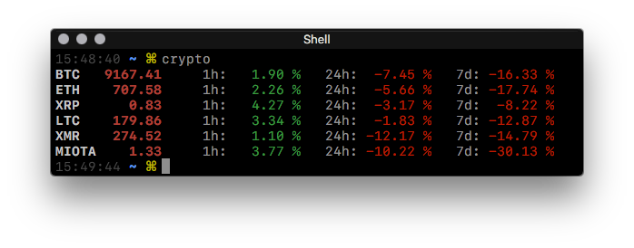

# Crypto

Check crypto prices in cmdline

**Check your favourite cryptos**

Change the variable `mycoins` to your desired coins.

`$ crypto`

**Check all cryptos**

`$ crypto all`

**Check spesific cryptos**

`$ crypto ripple BTC monero LTC`
